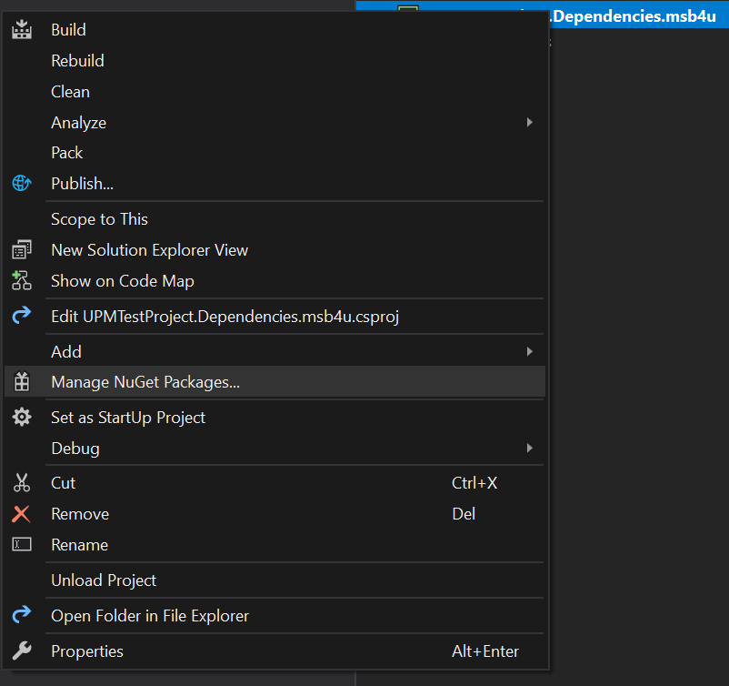
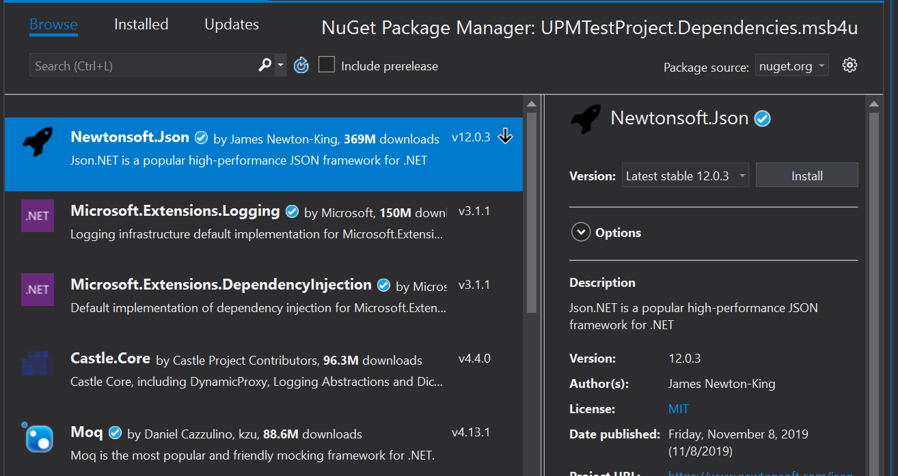
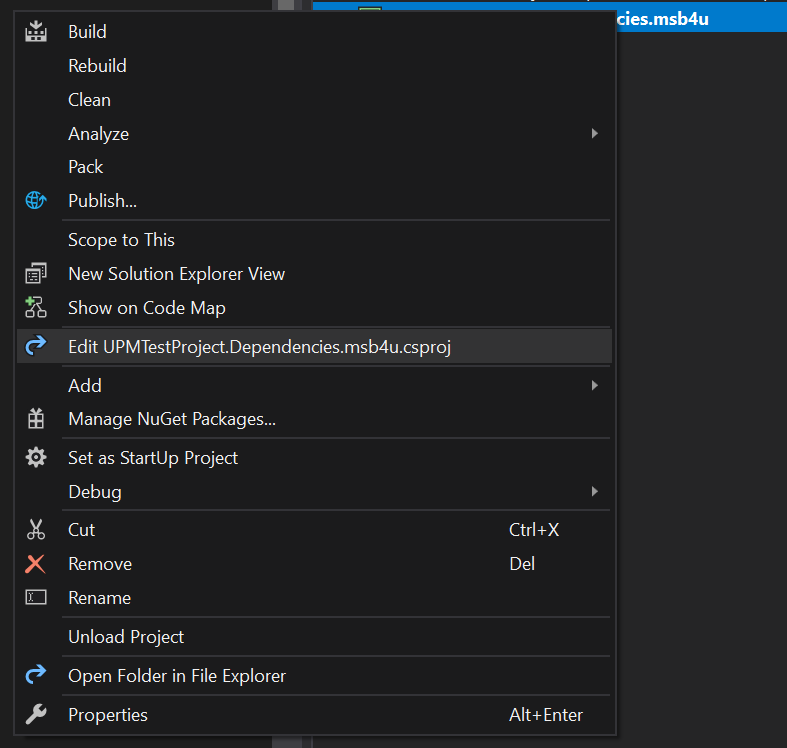

# Core Scenarios w/ MSBuildForUnity (MSB4U)

This documentation outlines instructions for the core scenarios that are enabled with MSB4U, and how to get started with them. Each scenario assumes the reader understand how to add MSB4U to the Unity project, if not, take a look at [the instructions](../README.md#Quick-Start). If you have issues following scenarios, see [troubleshooting](Troubleshooting.md).

## Scenario 1: Adding NuGet Dependency to Unity Project

**GOAL:** We have a Unity project where we want to add the `Newtonsoft.Json` NuGet package for use in the project.

To make this happen, we will simply rely on MSB4U providing us with a top-level MSBuild project that builds itself plus other MSBuild projects in our Unity assets directory, and add our reference to it. As a result, this project will be built, and it's dependencies and references will be brought into it's output directory inside the Unity assets folder.

### Scenario 1 Instructions

1. Find the generated dependencies project in your Assets folder. It is named after your Unity project; ie. `(UnityProjectName).Dependencies.msb4u.csproj`.
2. Double-click the project, to open it in Visual Studio.
3. Right-click on the `(UnityProjectName).Dependencies.msb4u`, and press `Manage NuGet Packages...`
    
4. In the NuGet Manager window, ensure `Browse` is Selected, and select `Newtonsoft.Json`
    
5. On the right side, press `Install` to install it to the project.
    > **NOTE:** Ensure to save the project in Visual Studio.
6. *Temporary Limitation:* Open the project file in any text editor, and ensure that the `PackageReference` is above the `Import Targets`, see example below:

    ```xml
     <!-- SDK.props is imported inside this props file -->
    <Import Project="$(MSBuildForUnityGeneratedProjectDirectory)\$(MSBuildProjectName).g.props" />

    <ItemGroup>
        <PackageReference Include="Newtonsoft.Json" Version="12.0.3" />
    </ItemGroup>

    <!-- SDK.targets is imported inside this props file -->
    <Import Project="$(MSBuildForUnityGeneratedProjectDirectory)\$(MSBuildProjectName).g.targets" />
    ```

7. Back in Unity, the build should now happen and your dependency will appear under `Dependencies\{Current TargetFramework}\` folder.

## Scenario 2: Share C# Library between Unity Projects

**GOAL:** We have two Unity projects, and want to share a C# library that contains common code.

This is similar to `Scenario 1`, but we will rely on the editing the dependency project manually here.

### Scenario 2 Instructions

1. Find the generated dependencies project in your Assets folder. It is named after your Unity project; ie. `(UnityProjectName).Dependencies.msb4u.csproj`.
2. Double-click the project, to open it in Visual Studio.
3. Right-click on the `(UnityProjectName).Dependencies.msb4u`, and press `Edit (UnityProjectName).Dependencies.msb4u.csproj`
    
4. In the text window, add your `ProjectReference` as follows:

    ```xml
     <!-- SDK.props is imported inside this props file -->
    <Import Project="$(MSBuildForUnityGeneratedProjectDirectory)\$(MSBuildProjectName).g.props" />

    <ItemGroup>
        <!--Add NuGet or Project references here-->
        <ProjectReference Include="..\Relative\Path\To\Your.csproj" />
    </ItemGroup>

    <!-- SDK.targets is imported inside this props file -->
    <Import Project="$(MSBuildForUnityGeneratedProjectDirectory)\$(MSBuildProjectName).g.targets" />
    ```

5. Back in Unity, the build should now happen and your compiled project binary will appear under `Dependencies\{Current TargetFramework}\` folder.

## Scenario 3: Distribute Source w/ NuGet Package

**GOAL:** We want to distribute a .unitypackage (or zip file) that has a dependency on a NuGet package.

In `Scenario 1` and `Scenario 2` we seen how we can modify the MSBuild project provided to us by MSB4U to add a reference to our dependencies. Here, we will actually craft a simple MSBuild project where we will specify our dependency, and package it up along with our source code. Then, we will bring this .unitypackage into the consuming Unity project that has MSB4U installed, which will result in our project being built and it's dependency brought into the consuming Unity project assets folder.

> **NOTE:** For this scenario, it is assumed that the reader knows how to create a Unity package and import it into a project.

### Scenario 3 Instructions

1. Open up a Unity project, and setup a folder in the Assets directory with the following files (and contents). The CSProject file is specially documented to explain each piece.
    - `MyComponent.csproj`

    ```xml
    <Project>
        <!-- Import the MSB4U generated common project as we will rely on it. -->
        <Import Project="$([MSBuild]::GetPathOfFileAbove(MSBuildForUnity.Common.props))" Condition="Exists('$([MSBuild]::GetPathOfFileAbove(MSBuildForUnity.Common.props))')" />

        <PropertyGroup>
            <!-- Specify both of these target frameworks, as we will need to support them for Unity 2018 case. -->
            <TargetFrameworks>netstandard2.0;net46</TargetFrameworks>
        </PropertyGroup>

        <PropertyGroup>
            <!-- Make sure Unity ignores the contents of the output path. -->
            <BaseIntermediateOutputPath>.obj\</BaseIntermediateOutputPath>
            <OutputPath>.bin\</OutputPath>
        </PropertyGroup>

        <!-- Note that this is the special "NoTarget" SDK to prevent this project from producing a dll. -->
        <Import Project="Sdk.props" Sdk="Microsoft.Build.NoTargets" Version="1.0.85" />

        <ItemGroup>
            <!-- Specify your dependency here -->
            <PackageReference Include="Newtonsoft.Json" Version="12.0.2" />
        </ItemGroup>

        <Import Project="Sdk.targets" Sdk="Microsoft.Build.NoTargets" Version="1.0.85" />
    </Project>
    ```

    - `.gitignore`

    ```text
        /.bin/
        /.obj/
    ```

    - `MyComponent.cs`

    ```csharp
        using Newtonsoft.Json.Linq;

        public class Test
        {
            public static JObject Property = JObject.Parse("{ Hello: \"World\" }");
        }
    ```

2. Now, this folder could be packaged up and distributed.
3. Create a Unity project that will consume this component, and install MSBuildForUnity.
4. Bring this component in, and it will automatically build it.

## Scenario 4: Distribute a UPM Package w/ NuGet Dependency

**GOAL:** We want to distribute our source through UPM, but need a NuGet dependency.

In order to support this scenario, we simply follow `Scenario 3` in terms of setting up the C# project, and then establish a UPM dependency onto the MSBuildForUnity UPM package. This would bring in the MSBuildForUnity package by default and activate your C# Project.

### Scenario 4 Instructions

Instructions coming soon.