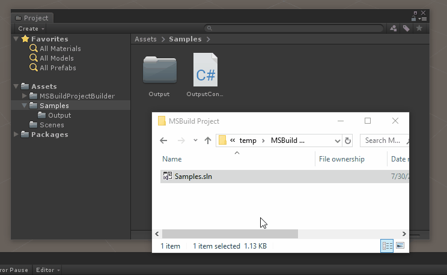
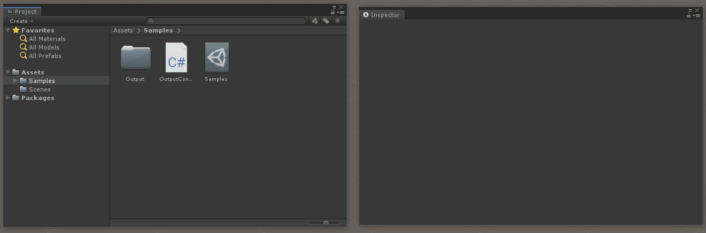
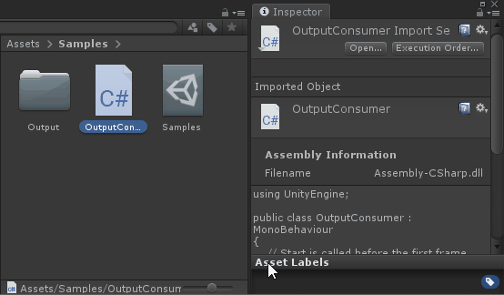

# MSBuild Project Builder

The MSBuild Project Builder provides a means of building MSBuild projects from within Unity, where the output is generally consumed by the Unity project. This is particularly useful when sharing code between a Unity project and a non-Unity project (e.g. UWP XAML, Xamarin, etc.) via a NuGet package or an MSBuild project.

## Project and Solution Importer

The simplest way to use the MSBuild Project Builder is to simply drop a .csproj or .sln into a Unity project (somewhere under Assets). A [custom scripted importer](../../Source/MSBuildProjectBuilder/Assets/MSBuildProjectBuilder/Editor/MSBuildProjectImporter.cs) will create a [custom asset](../../Source/MSBuildProjectBuilder/Assets/MSBuildProjectBuilder/Editor/MSBuildProjectReference.cs) that allows the MSBuild project to be built from within Unity. The project/solution will immediately be built, and will also be built whenever the project/solution changes, or when the Unity project is reloaded. Note there are some [considerations](#considerations) in how the project and directory structure are organized to ensure the source is compiled by MSBuild and not by Unity.

## Manual Asset Creation

It's also possible to manually create a reference to an MSBuild project/solution, which may even live outside of the Unity project. Simply create an *MSBuild Project Reference* asset and point it to an MSBuild project/solution.

## Manual Build

Referenced MSBuild projects/solutions are automatically built when the Unity project is loaded. They can also be built manually from within the Unity Editor. All referenced projects/solutions can be built from the top level MSBuild menu.

Alternatively, individual projects/solutions can be built from the inspector.

## Considerations

When dropping an MSBuild project/solution into a Unity project, some additional configuration is typically required to get the right behavior:
- If the project compiles source code, Unity must not *also* compile that source code. The simplest way to achieve this is to ensure the source code lives in a directory starting with a '.' (which Unity will ignore).
- If both an MSBuild project and a containing solution are dropped into the Unity project, only the solution should be built (to prevent double building the project). The simplest way to achieve this is to ensure the project lives in a directory starting with a '.' (which Unity will ignore).
- The build output typically should not be checked in to source control. If git is being used, the simplest way to ensure this is to simply add a .gitignore to the output directory.

See the Source/MSBuildProjectBuilder/Assets/Samples directory for an example.

## Programmatic Builds

MSBuild projects/solutions can also be built programmatically via [MSBuildProjectBuilder](../../Source/MSBuildProjectBuilder/Assets/MSBuildProjectBuilder/Editor/MSBuildProjectBuilder.cs).

`MSBuildForUnity.MSBuildProjectBuilder.BuildAllProjectsAsync` - use one of these overloads to build all MSBuild projects/solutions referenced by `MSBuildProjectReference`s in the Unity project.

`MSBuildForUnity.MSBuildProjectBuilder.BuildProjectsAsync` - use one of these overloads to build a specified collection of projects/solutions referenced by `MSBuildProjectReference`s.

`MSBuildForUnity.MSBuildProjectBuilder.BuildProjectAsync` - use one of these overloads to build a specified project/solution referenced by a `MSBuildProjectReference`.