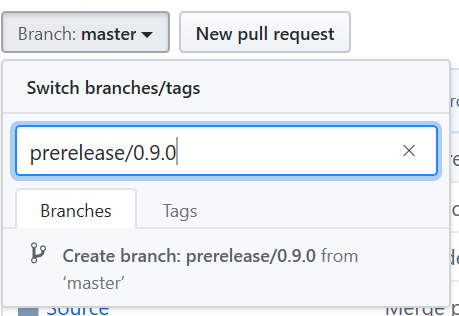

# Release Instructions

This document outlines the general release instructions that should be followed for making a release. It focuses on updating versions, creating branches, and testing pieces.

## Release Types

There are also two main release types, a major/minor release from master branch, or a HotFix release for a specific major/minor combination. The two differ primarily in how stabilization branches are created, and how changes are brought back to master.

> It is recommended to read [Semantic Versioning](https://semver.org/) to understand the intent between Major, Minor and Patch versioning scheme.

### Type 1: HotFix Release

This release focuses on patching functionality (fixing a bug) in some specific major/minor release. To do this, find the latest release branch with highest patch version of the major/minor pair, i.e. for `0.8` it is `release/0.8.3` at the time of this writing. This is the branch that you will create your stabilization branch from.

Follow the [stabilization process](###stabilization-process) and [creating a release](###creating-a-release) instructions below, and then continue with [hotfix cherry-pick](###hotfix-cherry-pick) instructions here.

### Type 2: Major or Minor Release

The second type of release is when new functionality being developed in master branch is released under a new major/minor pair. The rule of thumb is that a breaking change results in the increment of the `major` version, and a non-breaking feature set release results in the increment of a `minor` version.

The branch to use for stabilization is master, and then follow the [stabilization process](###stabilization-process) and [creating a release](###creating-a-release) instructions below. Once complete, follow the [merge to master](###merge-to-master) instructions.

## Process Steps

These steps are the core stages of creating a release for MSBuildForUnity.

### Stabilization Process

Once the branch from which to snap a release has been determined, the following steps should be taken (release version is referenced as `x.y.z`):

> NOTE: All work should happen on a branches prefixed with `prerelease`.

1. Create a stabilization branch `prerelease/x.y.z` with your version from the branch the release is based on.

    

2. Perform the [release version upgrade](####release-version-upgrade) below, and PRs your changes to `prerelease/x.y.z` branch.
3. Create your packages for testing.
    - Produce a [Release NuGet Package](https://mscodehub.visualstudio.com/MSBuildForUnity/_build?definitionId=1096&_a=summary) by pressing `Queue Build` and select your `prerelease/x.y.z` branch.
    - Produce a [UPM Package](https://dev.azure.com/UnityDeveloperTools/MSBuildForUnity/_build?definitionId=1&_a=summary) by pressing `Run Pipeline` and select your `prerelease/x.y.z` branch.
4. *For Type 2 Releases:* Perform a [master version upgrade](####master-version-upgrade) step.
5. Send out a notification with the test packages, and test the following scenarios:
    - [Core Scenarios](CoreScenarios.md)
    - That all of the Samples Build and work as expected, under `{Repository Root}\Samples`
    - Other miscellaneous test cases.
6. Make changes into the branch producing new release packages as you go.

#### Release Version Upgrade

Commits need to be made to manually increment all the appropriate version locations. In the stabilization branch, the following locations must all match the release `Major.Minor.Patch` version:

- In `{Repository Root}\README.md` update `"com.microsoft.msbuildforunity"` location under `Quick Start`.
- In `{Repository Root}\Directory.Build.props` file, update `MSB4U_MajorVersion`, `MSB4U_MinorVersion`, and `MSB4U_RevisionVersion`.
- In `{Repository Root}\Source\MSBuildTools.Unity\Packages\com.microsoft.msbuildforunity\package.json` file, update `"version"`.
- In `{Repository Root}\Source\MSBuildTools.Unity\Packages\com.microsoft.msbuildforunity\Editor\ProjectGenerator\Scripts\MSBuildTools.cs` file, update `MSBuildForUnityVersion`.

#### Master Version Upgrade

The master version performs an automatic minor version upgrade when building the UPM and the NuGet package, because of this, there is one spot that will need to be upgraded when you bring the [release version upgrade](####release-version-upgrade) changes to master as par tof step 4 above.

- In `{Repository Root}\Source\MSBuildTools.Unity\Packages\com.microsoft.msbuildforunity\Editor\ProjectGenerator\Scripts\MSBuildTools.cs` file, update `MSBuildForUnityVersion` by incrementing the minor version by 1. So if your release version is `0.8.3`, then this becomes `0.8.4`.

> NOTE: Before the increment, but **after** the merge to master make sure you make a [NuGet package build](https://mscodehub.visualstudio.com/MSBuildForUnity/_build?definitionId=1096&_a=summary) by pressing `Queue Build` and select your `master` branch.

### Creating a Release

When stabilization is finished, we can go ahead and finalize this release. Do not start this process if you expect any additional changes. As part of this process, the following should happen:

1. Create a `release/x.y.z` branch from the `prerelease/x.y.z`, and push that to GitHub.
2. Produce the final (for this release) set of packages:
    - Produce a [Release NuGet Package](https://mscodehub.visualstudio.com/MSBuildForUnity/_build?definitionId=1096&_a=summary) by pressing `Queue Build` and select your `release/x.y.z` branch.
    - Produce a [UPM Package](https://dev.azure.com/UnityDeveloperTools/MSBuildForUnity/_build?definitionId=1&_a=summary) by pressing `Run Pipeline` and select your `release/x.y.z` branch.
3. Publish a GitHub release, tagging the branch.

### Merge to Master

Once you are done with a major/minor style release, you should merge the fixes made back to master. As part of the merge, make sure you don't re-update the `MSBuildTools.cs` version.

### HotFix Cherry-Pick

Once a HotFix goes in, you could *optionally* cherry-pick changes to the master branch, depending on the change.
