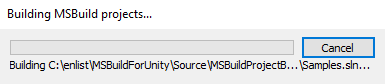

# MSBuildForUnity

MSBuildForUnity is a [collection of tools](#features) to help integrate MSBuild with Unity. This is helpful in leveraging more of the .NET ecosystem within Unity. Some things this project helps with are:
- Sharing code (via an MSBuild project) between Unity and other .NET projects (such as UWP XAML apps, Xamarin apps, etc.).
- Consuming existing .NET components (e.g. NuGet packages).

## Contributing

This project welcomes contributions and suggestions.  Most contributions require you to agree to a
Contributor License Agreement (CLA) declaring that you have the right to, and actually do, grant us
the rights to use your contribution. For details, visit https://cla.opensource.microsoft.com.

When you submit a pull request, a CLA bot will automatically determine whether you need to provide
a CLA and decorate the PR appropriately (e.g., status check, comment). Simply follow the instructions
provided by the bot. You will only need to do this once across all repos using our CLA.

This project has adopted the [Microsoft Open Source Code of Conduct](https://opensource.microsoft.com/codeofconduct/).
For more information see the [Code of Conduct FAQ](https://opensource.microsoft.com/codeofconduct/faq/) or
contact [opencode@microsoft.com](mailto:opencode@microsoft.com) with any additional questions or comments.

### Prerequisites

The following tools are required to contribute to this project:
- [Visual Studio 2017+](https://visualstudio.microsoft.com/downloads)
- [Unity 2018+](https://unity3d.com/get-unity/download)

To get started, clone the repo, and then run `git submodule update --init` to initialize submodules.

## Quick Start

Following are basic instructions for taking advantage of MSBuildForUnity for some common scenarios.

### Scenario 1: Bring NuGet packages and MSBuild projects into a Unity project

This scenario leverages the MSBuildForUnity [Project Builder](#msbuild-project-builder) and the MSBuildForUnity [NuGet Package](#msbuildforunity-nuget-package).

1. Add the `com.microsoft.msbuildforunity` UPM (Unity Package Manager) package.
    - Edit the `Packages/manifest.json` file in your Unity project.
    - Add the following near the top of the file:
        ```json
        "scopedRegistries": [
            {
                "name": "Microsoft",
                "url": "https://pkgs.dev.azure.com/UnityDeveloperTools/MSBuildForUnity/_packaging/UnityDeveloperTools/npm/registry/",
                "scopes": [
                    "com.microsoft"
                ]
            }
        ],
        ```
    - Add the following to the `dependencies` section of the file:
        ```json
          "com.microsoft.msbuildforunity": "0.1.1-20190816.2.0"
        ```
1. Create a "SDK style" MSBuild project (e.g. csproj) somewhere under your `Assets` directory of your Unity project that references the `MSBuildForUnity` NuGet package. Here is an example:
    ```xml
    <Project Sdk="Microsoft.NET.Sdk">
        <PropertyGroup>
            <TargetFramework>netstandard2.0</TargetFramework>
        </PropertyGroup>
        <ItemGroup>
            <PackageReference Include="MSBuildForUnity" Version="1.0.0">
                <PrivateAssets>all</PrivateAssets>
                <IncludeAssets>runtime; build; native; contentfiles; analyzers</IncludeAssets>
            </PackageReference>
        </ItemGroup>
    </Project>
    ```
1. Add additional references to any NuGet packages you want to use in your Unity project.

## Features

MSBuildForUnity has several features that can be used independently or in conjunction.

### MSBuild Project Builder

The MSBuild Project Builder provides a means of building MSBuild projects from within Unity, where the output is generally consumed by the Unity project.

[](Documentation/MSBuildProjectBuilder/MSBuildProjectBuilder.md)

For details, see the [documentation](Documentation/MSBuildProjectBuilder/MSBuildProjectBuilder.md), [source](Source/MSBuildTools.Unity/Packages/com.microsoft.msbuildforunity/Editor/ProjectBuilder/MSBuildProjectBuilder.cs), and [samples](Source/MSBuildTools.Unity/Assets/Samples/Samples.sln).

### MSBuild Project Generator

The MSBuild Project Generator will generate a Visual Studio solution configured for building the Unity project into DLLs outside of Unity. This solution is configured for each of the platforms installed with Unity and the InEditor/Player variants of the assemblies.

### MSBuildForUnity NuGet Package

The `MSBuildForUnity` NuGet package augments the default MSBuild build logic to ensure the build output is suitable for Unity consumption. This package can be referenced from MSBuild projects that are built by the [MSBuild Project Builder](#msbuild-project-builder) to add these features:

- Meta file generation - generates .meta files for build output such as .dlls.
- Dependency resolution - all dependencies (through `PackageReference`s or `ProjectReference`s) are resolved and sent to the output directory (which is typically under the Unity project's Assets directory).
- Debug symbol patching - enables debugging pre-built dlls (e.g. from NuGet packages) while running in the Unity Editor.

For details, see the [documentation](Documentation/MSBuildForUnityNuGetPackage/MSBuildForUnityNuGetPackage.md), [source](Source\MSBuildTools.Unity.Nuget\MSBuildForUnity.csproj), and [samples](Source/MSBuildTools.Unity/Assets/Samples/Samples.sln).