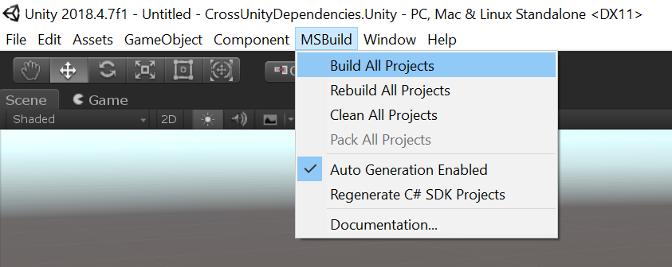

# Cross Unity Dependencies

This sample is a demonstration of how MSBuildForUnity (MSB4U) could be used for establishing a dependency relationship across two different Unity projects. In this sample, we establish a dependency on `../IntegratedDependencies.Unity/Assets/GeneralComponent/` that is part of the `IntegratedDependencies.Unity` sample Unity project. The dependency code is then built with the context (selected platform, its defines, current platform, and DLLs it reference) of the consuming project.

> Note: This is almost like establishing an Assembly Definition (AsmDef) reference between two Unity projects.


## Running the Sample

To run this sample, follow these steps:

1. Due to a current limitation, you must first open the `IntegratedDependencies.Unity` Unity project.
2. After that project loaded and built, you can open the `CrossUnityDependencies.Unity` project in the Unity editor.

### Editing the Dependency

To edit the dependency code (in the `IntegratedDependencies.Unity` unity project), that should ideally be done with the Unity project open. After which, go back to this (`CrossUnityDependencies.Unity`) project editor and press `MSBuild > Build All Projects`:



## Establishing this Dependency

In order for this dependency to be established, the following line was added `Assets/Dependencies.msb4u.csproj`:

```xml
<ProjectReference Include="..\..\IntegratedDependencies.Unity\Assets\GeneralComponent\GeneralComponent.msb4u.csproj" />
```

In addition to that, the same line was added to the specific MSB4U project that is responsible for the code that depends on this, in this case it's the overall `Assembly-CSharp.msb4u.csproj` that is responsible for the top-level scripts. Here is the complete contents of the file:

```xml
<Project ToolsVersion="15.0">
  <!--GENERATED FILE-->
  <!--
    This file can be modified and checked in as long as the following rules are met:
    - Both the imports are present:
    - - <Import Project="$(MSBuildProjectName).g.props" />
    - - <Import Project="$(MSBuildProjectName).g.targets" />
    - Nothing above the props import or below the targets import is modified
    - No C# source files are added for compilation
    
    You can modify this file as follows:
    - Add NuGet package references:
        <ItemGroup>
          <PackageReference Include="Newtonsoft.Json" Version="11.0.1" />
        </ItemGroup>
    - Add external C# project references:
      <ItemGroup>
        <ProjectReference Include="..\..\..\ExternalLib\ExternalLib.csproj" />
      </ItemGroup>
  -->
  
  <Import Project="$([MSBuild]::GetPathOfFileAbove(MSBuildForUnity.Common.props))" Condition="Exists('$([MSBuild]::GetPathOfFileAbove(MSBuildForUnity.Common.props))')" />
  <PropertyGroup>
    <!--anborod: This is a weird thing, it is a required property (even if commented)-->
    <!--<TargetFrameworks>netstandard2.0;uap10.0;net46</TargetFrameworks> -->
  </PropertyGroup>

  <!-- SDK.props is imported inside this props file -->
  <Import Project="$(MSBuildForUnityGeneratedProjectDirectory)\$(MSBuildProjectName).g.props" />

  <ItemGroup>
    <!-- Add your references here -->
    <!-- This reference to a separate Unity project should also be placed in Dependencies.msb4u.csproj. -->
    <ProjectReference Include="..\..\IntegratedDependencies.Unity\Assets\GeneralComponent\GeneralComponent.msb4u.csproj"/>
  </ItemGroup>

  <!-- SDK.targets is imported inside this props file -->
  <Import Project="$(MSBuildForUnityGeneratedProjectDirectory)\$(MSBuildProjectName).g.targets" />
</Project>
```

## Limitations

### MSB4U Generation in the Dependency

Some of the MSB4U artifacts must be generated for the dependency, because of that you must open the dependency Unity project (`IntegratedDependencies.Unity` in this case) at least once. This will generate all the `.g.targets` and `.g.props` files needed.

### Compatibility of the Code

The dependency code is built using the compilation context of the consuming project (selected platform, its defines, current platform, and DLLs it reference.) This means that the dependency Unity project must be *"compatible"* with the editor version of the consuming project (`CrossUnityDependencies.Unity` in this case). This doesn't mean same version, but does mean that the code must build in the consuming Editors version.

### Duplicate Dependency Reference

Due to a current technical limitation, the cross-unity dependency must always be added to the top level `Dependencies.msb4u.csproj` project, even as it's added to some other AsmDef-based generated project.
